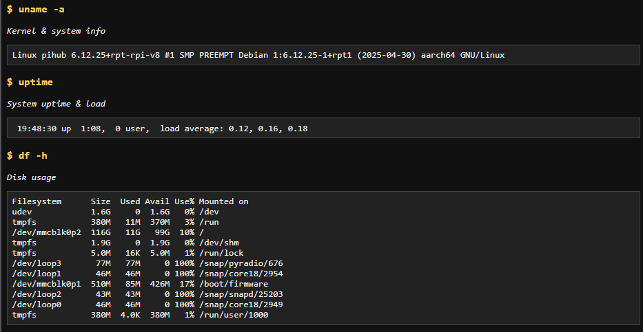

# Network Automation Lab

A lightweight network automation project built with **FastAPI**, **Jinja2**, and **Paramiko**.
This tool connects to a target device via SSH, executes predefined diagnostic commands from YAML playbooks, and renders the results in a simple web dashboard.

---

##Features

* **FastAPI backend** – REST routes for triggering playbooks.
* **Jinja2 templates** – clean HTML rendering of command output.
* **YAML playbooks** – define repeatable command sets without editing code.
* **Paramiko SSH engine** – securely connect and run commands on remote devices.
* **Environment variable credentials** – host/user/password pulled from `.env`.
* **Output logging** – optional file storage of playbook results.

---

## Project Structure

```
.
├── ssh_connect.py    # Core SSH + playbook execution logic
├── main.py           # FastAPI app entrypoint
├── playbooks.yaml    # Example playbooks (ping, ip, uptime, etc.)
├── templates/
│   └── results.html  # Jinja2 template for result rendering
├── .env              # Host credentials (you need to create this)
└── README.md
```

---

## Usage

### 1. Clone repo & install dependencies

```bash
git clone https://github.com/Dreadwolf26/NetworkAutomationLab.git
cd NetworkAutomationLab
pip install -r requirements.txt
```

### 2. Set up environment

Create a `.env` file:

```
PI_HOST=yourhost
PI_USER=yourusername
PI_PASS=yourpassword
```

### 3. Define playbooks

Example (`playbooks.yaml`):

```yaml
playbooks:
  - id: pi_status
    name: "Raspberry Pi Status"
    commands:
      - cmd: "hostname -I"
        description: "Show IP address"
      - cmd: "uname -a"
        description: "Kernel & system info"
      - cmd: "uptime"
        description: "System uptime & load"
      - cmd: "df -h"
        description: "Disk usage"
      - cmd: "ping google.com -c 4"
        description: "Ping test to Google"
      - cmd: "netstat -a"
        description: "Network connections"
    store_output: "pi_status.log"
    safe: true
```

### 4. Run app

```bash
uvicorn main:app --reload
```

### 5. Open in browser

Visit:

```
http://127.0.0.1:8000/run/pi_status
```

---

## Screenshots



---

## Tech Stack

* Python 3.x
* FastAPI
* Jinja2
* Paramiko
* PyYAML

---

## Next Steps

* Add multiple devices via `devices.yaml` or Postgres.
* Log history of playbook runs.
* Extend playbooks to Cisco/Juniper devices using Netmiko.
* Containerize with Docker for easy deployment.


